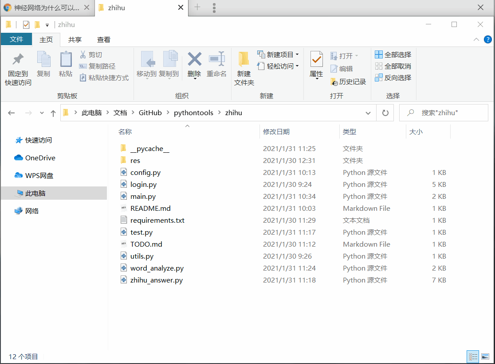

### 安装依赖

```
pip install -r requirements.txt
```

### 使用

运行命令：

```
cd zhihu
python main.py
```



### 参考

[-zhihu-crawl-](https://github.com/visionshao/-zhihu-crawl-)

[偶尔有点小迷糊/30行Python代码得出《三体》中最多提到的人](https://www.bilibili.com/video/BV19b411j7E5)